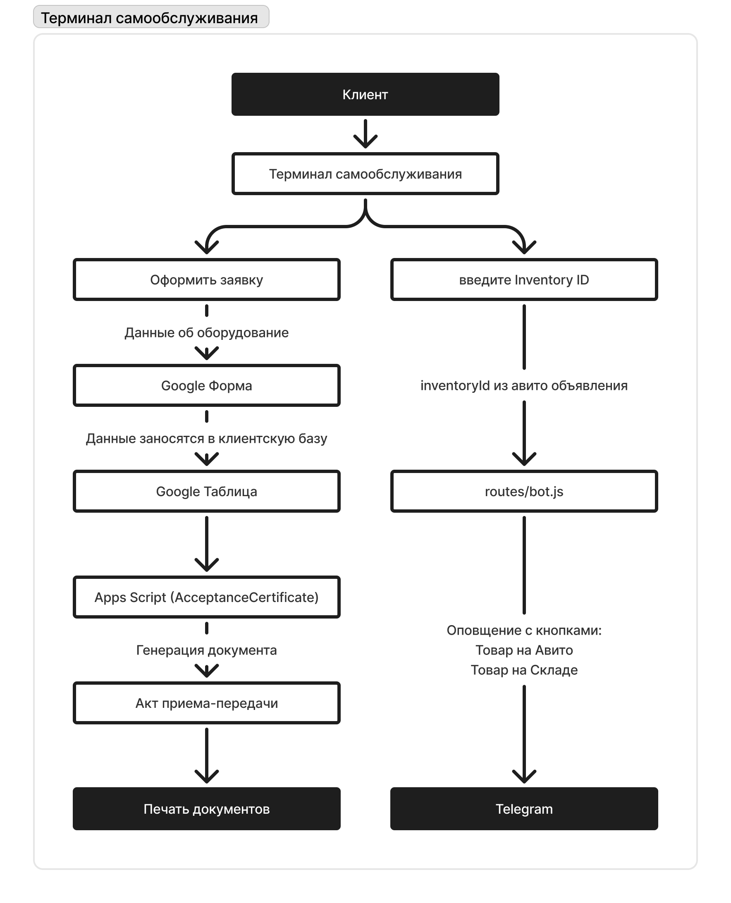
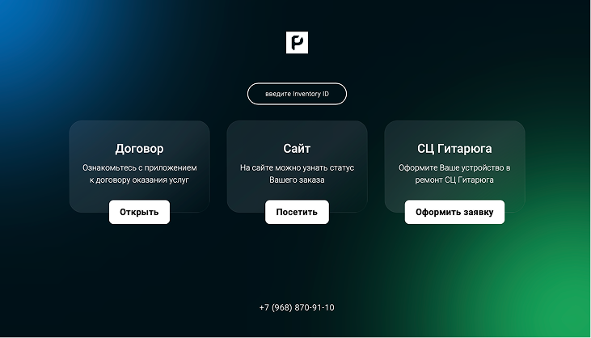
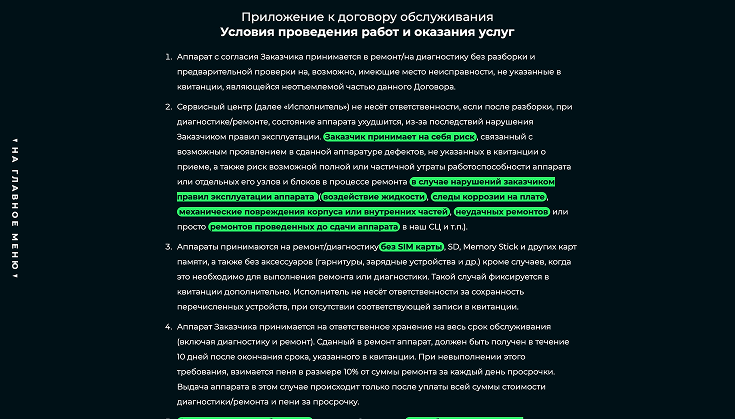
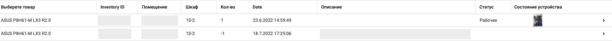
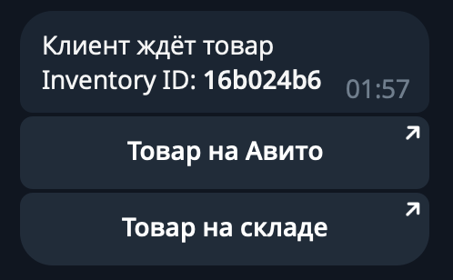

# Автоматизация для малого бизнеса (Homelab)

**Год:** 2022  
**Контекст:** Создан для небольшого сервисного центра (СЦ) без бюджета на автоматизацию  
**Статус:** Архивный (первый проект) 
**Тип:** MVP, работающее в реальных условиях  
**Автор:** @NordStory

## Обзор

Этот проект — самодельный терминал самообслуживания и система склада для небольшого сервиса по ремонту электроники. Компания столкнулась с ростом потока клиентов, хаосом в учёте товаров и отсутствием автоматизации. Моя задача — упростить и ускорить процессы, используя только бесплатные инструменты и минимальный код.

## Основные проблемы

### 1. Неэффективный приём клиентов СЦ

- Ручной ввод данных и ручное формирования акта приёма по каждой материнской плате занимал до **30 минут на клиента**.
- Администраторы одновременно вводили данные, консультировали и искали товары.
- Очереди и потеря клиентов.

### 2. Потери продаж из-за беспорядочного учёта товаров на Авито

- Товары выкладывались на Авито, но хранились беспорядочно.
- Поиск товара занимал 10–40 минут.
- Только 50% клиентов получали нужный товар → **потеря выручки и негативные отзывы**.

## Ключевые решения

| Область             | Решение                                                                   |
|---------------------|---------------------------------------------------------------------------|
| 🧾 Приём клиентов    | Google Форма + Apps Script → автоматическая генерация акта приёма        |
| 📦 Учёт товаров      | Складское приложение на базе AppSheet и Google Таблиц → мобильный доступ к складу     |
| 💬 Уведомления       | Система поиска товара на складе и на авито → Telegram-бот → оповещение кладовщика о выдаче товара                           |
| 🧑‍💻 Интерфейс       | Терминал самообслуживания на ресепшене               |

## Технологии

- Google Таблицы + Google Apps Script  
- Google Формы  
- AppSheet (бесплатный тариф)  
- Telegram Bot API  
- Js / HTML / Node.js

## Архитектура

## Функционал терминала

Мини-ПК с терминалом самообслуживания на ресепшене. Возможности:

* Клиент самостоятельно оформляет заявку на ремонт
* Просмотр и согласие с договором
* Переход на сайт компании
* Отображение QR-кода с номером телефона сервиса
* Ввод Inventory ID для получение заказа → уведомление кладовщика через Telegram

## Результаты

| Было                 | Стало                                  |
| -------------------- | -------------------------------------- |
| 30 минут на приём    | \~3–5 минут благодаря самообслуживанию и генерации акта приема |
| Ручной поиск товара  | Мгновенный поиск по ID                 |
| Частые потери оборудования | В помещение склада было реализованно адресное хранение.        |
| Отсутствие учёта     | Полный цифровой учёт товара            |

## Скриншоты

_Терминал самообслуживания:_ 

_Так выглядит созданная на AppSheet система склада:_ 

_Сообщение Telegram-бота:_ 

## О проекте

Этот проект — мой первый опыт построить реальную систему автоматизации. Код далёк от идеала, но отражает инженерное мышление.